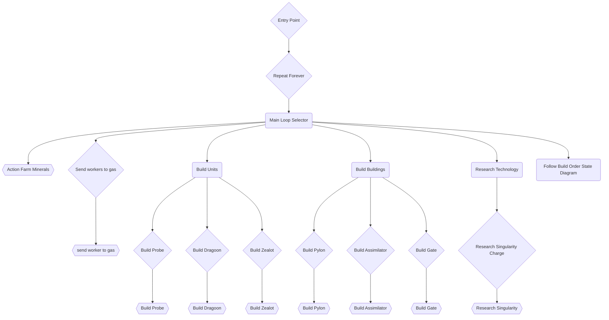

# INF584 - Starcraft Bot

## Team Members

- Eyal Benaroche
- Sakula Hys
- Emeric Marguet
- Mathias Velo

## Project Description

The goal of this project is to create a **Protoss Bot** and beat other players in the INF584A course at Ecole Polytechnique.
The bot is developped on StarCraft : Brood War using the BWAPI library with the original codebase of [Dave Churchill](https://github.com/davechurchill/STARTcraft)

## Bot Strategy

The overall strategy of the bot is to follow a certain build oder, i.e. deterministic actions during the game. This is gradually incremented during the 
game to follow the said order, depending on what stage of the game is bot is actually in.\
Once the determined build order is completed, the bot is set on 'automatic mode' to deal with these tasks more independently.\
In parallel, a behavior tree can describe the management of units and resources. When a condition is met, the bot starts building or
creating units, depending on the other statistics, like number of units or resource. (see below for details : Data Structures)\

For the battling strategy, we chose our bot to be rather offensive. When a certain number of units is reached, they are sent to look
for the enemy and start engaging into a battle. If they all die, another batch waits at a rally point, before being sent again.\
Depending on the race of the enemy, the way of dealing with their units will be different.
Typically, a Zerg enemy is known to be handled more easily when gated, therefore in this case, the bot should build a bottleneck at
the entrance of the base with buildings.

### Units and Technology Branch

Following the specific build order, the exploration of the technology branch is constrained to stay efficient.
The developed technology is the vital buildings (Pylons and Assimilators), and, on the other hand, basic buildings to produce battling units.
In depth, the exploration does not go deeper than Cybernetic Cores.\
In the implemented strategy, the main units are Probes for mining and construction, and Dragoons for efficient offensive power. 


### Data Structures

The main bot is following a behaviour tree for most of his behaviour. We have developped in parallel other data structure such as Final State Machine (FSM) that are described later on with the Build-Order State Diagram.

#### Main Behaviour Tree



#### Build Order State Diagram

The role of the State Diagram is to add some abstraction to the code to help us modify and follow a build order strategy for the early game. 

Here we want to keep producing as many pylons as possible to have a bigger army and many Gates as long as our economy allows us to do so while keeping a track of the state of the game and our progression (to help us not to create too many buildings at once whithout any army).
The Build order has been experimented on and should be keep as it is now as it's an optimized version for our strategy.

In the diagram below, every build is conditioned by the availability of enough resources.


It is not, properly speaking, a FSM since some of the states are being active at the same time, for example building probes is active
continuously, while building some of the other units or buildings when a condition is met. In fact, it is too complex to describe the whole
system with mutually exclusive states, because different levels of unit management are done at the same time for efficiency. However,
if necessary, a FSM could be used to describe the state of a given unit rather than the whole macro-system. 

### Debugging features

The debugging features are mainly for clarity and confort, and consist in the ones already present in the initial code,
(bounding boxes and health bars display) plus a display of action radii, which are centered on the base, rally points, and
attacking units. This last radius determines the distance within which an enemy should be in order to be targeted by an offensive unit.

### Distribution of tasks

## Setup Instructions:

This project can only run on Windows and the Starcraft game must be downloaded separately and then put on the `/windows/starcraft/` folder.

1. git clone this repository 

```bash
git clone https://github.com/Bicyclette/StarCraft_AI.git
```

2. Download and unzip [Starcraft Broodwar 1.16.1](http://www.cs.mun.ca/~dchurchill/startcraft/scbw_bwapi440.zip) to the included `windows/starcraft` folder
3. Run `windows/bin/RunStarterBotAndStarcraft.bat` which will launch the bot executable and Starcraft / BWAPI
4. Open `windows/visualstudio/StartCraft.sln` in Visual Studio 2022 to modify / recompile the code
